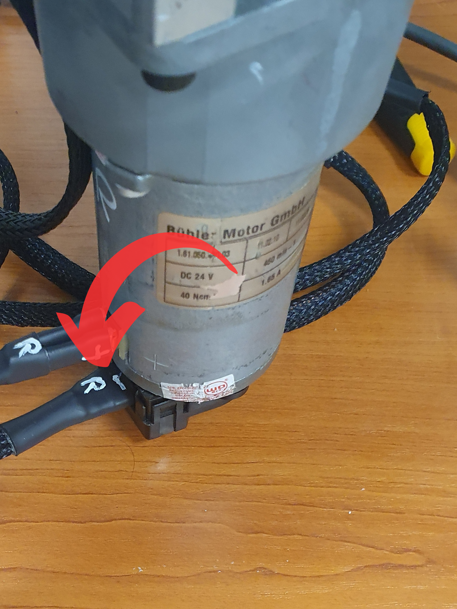
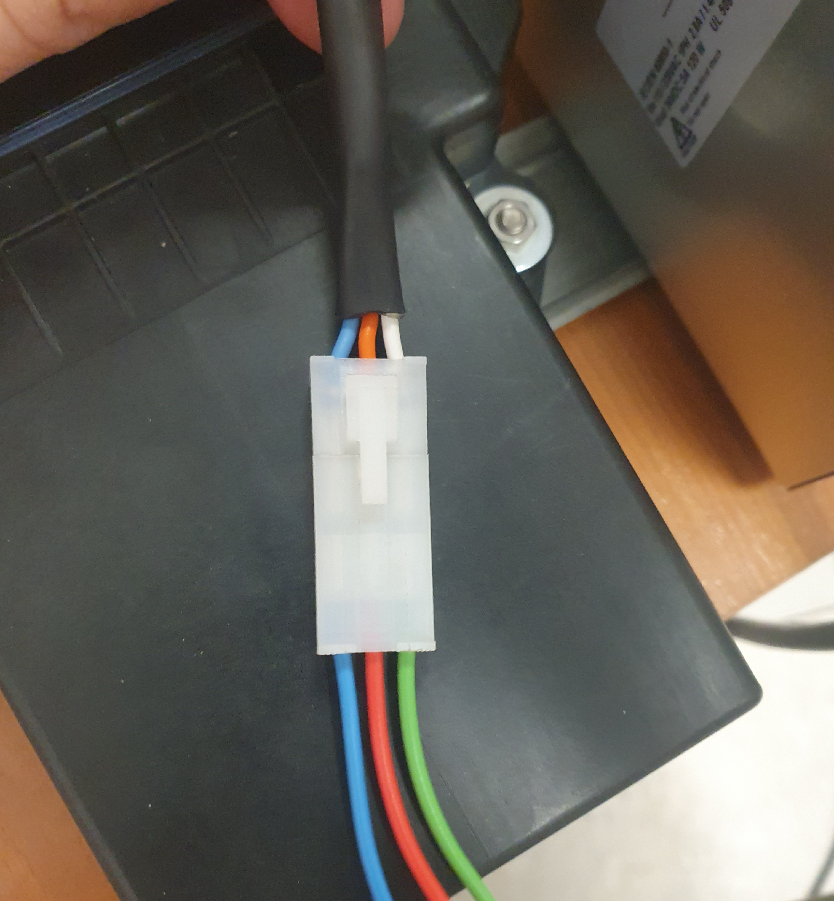

# Projekt napędu o zmiennej sztywności


Projekt zakładał wykonanie układu sterującego silnikami prądu stałego oraz układu pobierającego dane ze sensorów. Do realizacji założeń projektowych wybrano układ typu SOC - Esp32. Do łatwego implementowania algorytmów sterowania wykorzystano środowisko Matlab, które komunikuje się z Esp32 poprzez magistralę RS-232. 

## Najważniejsze połączenia
### Enkodery
Enkodery łączone są pięciopinowym gniazdem z opisem R (enkoder dla prawego silnika) oraz L (enkoder dla lewego silnika). Gniazdo powinno zostać wpięte napisem ku górze platformy (rysunek poniżej).

<p align="center">

</p>

### Czujnik Siły
W celu podłączenia czujnika siły należy skorzystać z przewodów ze zdjęcia poniżej. 
<p align="center">

</p>
 
| Kolor przewodu | Symbol   | Opis                                 |
| :------------- | :------- | :------------------------------------|
| Niebieski      |   GND    |                                      |
| Czerwony       |   Vcc    |Zasilanie zależne od wyjścia zasilacza|
| Zielony        |  Tens-In |Wejście napięciowe 0-5V               |

Czujnika nie można podłączyć bezpośrednio do przewodów opisaych powyżej. Należy zbudować układ przetwarzający dane z czujnika na napięcie 0-5V. Układ ten nie został zrealizowany przez autorów.
## Oprogramowanie
### Esp32
Oprogramowanie dla Esp32 zostało napisane w środowisku Arudino IDE. Źródła znajdują się w folderze [Esp32](your-project-name/tree/master/your-subfolder). W celu prawidłowej kompilacji należy w menadżerze płytek wybrać bibliotekę: esp32 by Sspressif Systems w wersji 1.0.6.

### Matlab
Źródła znajdują się w folderze [Matlab](your-project-name/tree/master/your-subfolder).

## Uruchomienie komunikacji
Głównym plikiem do komunikacji jest [main.m](your-project-name/tree/master/your-subfolder).  

W celu uruchomienia komunikacji należy wybrać odpowiedni port dla magistrali RS-232:

```matlab
% Nawiązanie komunikacji z urzadzeniem
s = Open_COMport('COM7');
```
Po uzyskaniu komunikacji dwoma najważniejszymi funkcjami są `sendMotorCmds` oraz `parser`.  
Funkcja `sendMotorCmds` pozwala na wysyłanie odpowiedniej ramki do Esp32.
```matlab
sendMotorCmds(s, CMD_right,CMD_left,i_right,i_left);
```
| Argument  | Warość     | Opis                |
| :-------- | :-------   | :------------------------- |
|  `s`      |            |  |
|  `CMD_right`    |  0 - STOP, 1 - BRAKE, 2 - RUN        | Komenda ustalająca odpowiedni stan prawego silnika  |
|  `CMD_left`    |            0 - STOP, 1 - BRAKE, 2 - RUN        | Komenda ustalająca odpowiedni stan lewego silnika  |
|  `i_right`    |    -1.5 ÷ 1.5        | Wartość prądu dla prawego silnika |
|  `i_left`    |     -1.5 ÷ 1.5       | Wartość prądu dla lewego silnika |

Funkcja `parser` pozwala na odebranie odpowiedniej ramki od Esp32.
```matlab
 [l_m_ss, r_m_ss, arm_Pos, arm_Tens, dt, errs] = parser(s);
```
Gdzie `l_m_ss` i `r_m_ss` są odpowiednio wektorami pozycji, prędkości oraz przyspieszenia dla lewego/prawego silnika.  
`arm_Pos` jest pozycją ramienia urządzenia.
`arm_Tens` jest wartością z czujnika siły.